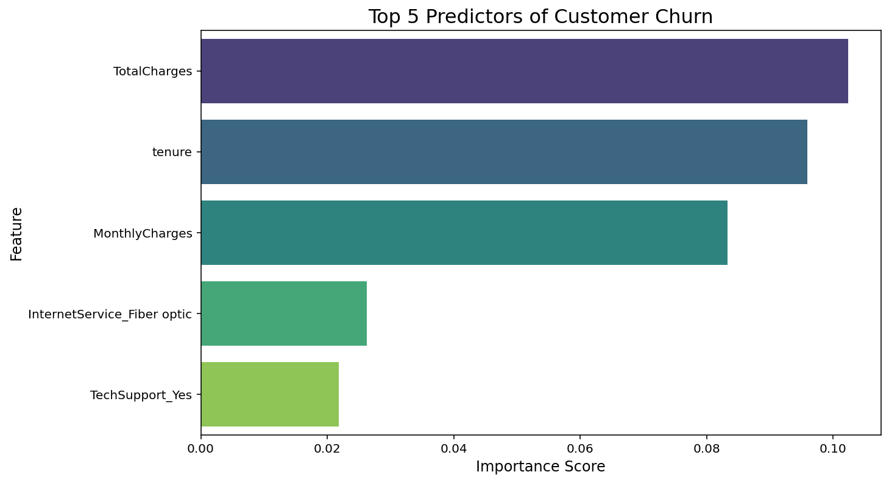

# 📊 Customer Attrition Analysis: Predicting Subscription Churn

## **Project Overview**
This project focuses on identifying high-risk customers for a Telecommunications provider. By analyzing customer behavior and service usage, I developed a Machine Learning model that predicts **Customer Attrition (Churn)** with **79% accuracy**.

---

## **The Business Challenge**
It is significantly more expensive to acquire a new customer than to retain an existing one. This project answers three critical business questions:
1. **Which customers** are most likely to leave?
2. **What are the primary drivers** of dissatisfaction?
3. **How can we improve** our retention strategy?

---

## **Key Insights & Results**

### **1. Top 5 Predictors of Churn**
Our Random Forest model identified these as the most influential factors:
* **Total Charges & Tenure:** A mathematical marker of loyalty; the first 5 months are the "Danger Zone."
* **Monthly Charges:** High monthly bills are a primary trigger for exit.
* **Fiber Optic Service:** High churn rates in this segment suggest pricing or stability issues.
* **Tech Support:** Customers with Tech Support stay longer, highlighting its value as a retention tool.




### **2. Model Performance**
| Metric | Score |
| :--- | :--- |
| **Accuracy** | 79% |
| **Precision (Churn)** | 0.66 |
| **Recall (Churn)** | 0.44 |

---

## **Technical Skills Demonstrated**
* **Language:** Python (Spyder IDE)
* **Data Manipulation:** `Pandas` (utilizing `dataset` naming convention)
* **Visualization:** `Seaborn`, `Matplotlib`
* **Machine Learning:** `Scikit-Learn` (Random Forest Classifier)
* **Model Persistence:** `Joblib`
* **Problem Solving:** Successfully identified and corrected **Data Leakage**.

---

## **Repository Structure**
```text
├── data/
│   └── telco_dataset.csv       
├── models/
│   └── churn_model.pkl         
├── notebooks/
│   └── Analysis_Report.ipynb   
├── images/
│   └── top_5_predictors.png    
└── README.md
```

---

## **🚀 How to Use This Project**

### **1. Prerequisites**
To run the analysis script or use the model, you will need Python installed along with the following libraries:
```bash
pip install pandas scikit-learn seaborn matplotlib joblib
```

### **2. Running the Analysis**
* Open the notebooks/ folder and launch the .ipynb file.

* The script is configured to load the dataset variable from the data/ directory.

* Run all cells to reproduce the Exploratory Data Analysis (EDA) and the training of the Random Forest model.

### **3. Making Predictions with the Saved Model**
You can skip the training process and use the pre-trained model (the "AI's brain") directly for new data:
```
import joblib

# Load the saved Random Forest model from the models folder
model = joblib.load('models/churn_model.pkl')

# Example: Predicting on new customer data
# predictions = model.predict(new_customer_data)

```

# 🎯 Future Roadmap
This project serves as a foundation. Future iterations will include:

* **Handling Class Imbalance**: Implementing SMOTE (Synthetic Minority Over-sampling Technique) to improve the model's ability to identify the minority "Churn" class.

* **Hyperparameter Tuning**: Utilizing GridSearchCV to optimize the Random Forest's depth and tree count.

* **Business Dashboarding**: Developing a Tableau Public dashboard using the CSV data to provide a "live" look at churn metrics. (Note: Tableau Public is used as it does not connect to Postgres).

---

## 📄 **License**
This project is licensed under the MIT License - see the [LICENSE](LICENSE) file for details.

---

## 📫 **Contact**

* **Favour Peter James** 
* **Portfolio** [https://peterjames2019.github.io/]
* **LinkedIn:** [https://linkedin.com/in/favour-peter-43b330263]
* **GitHub:** [https://github.com/peterjames2019]
